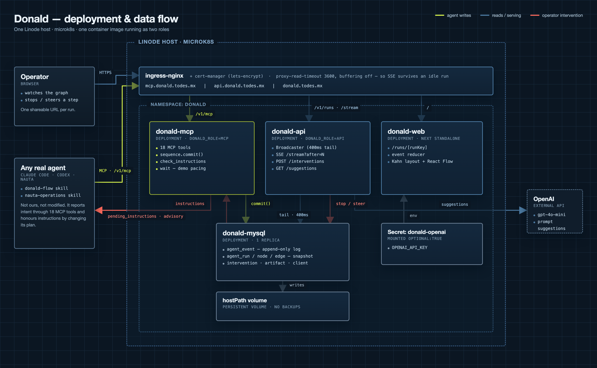
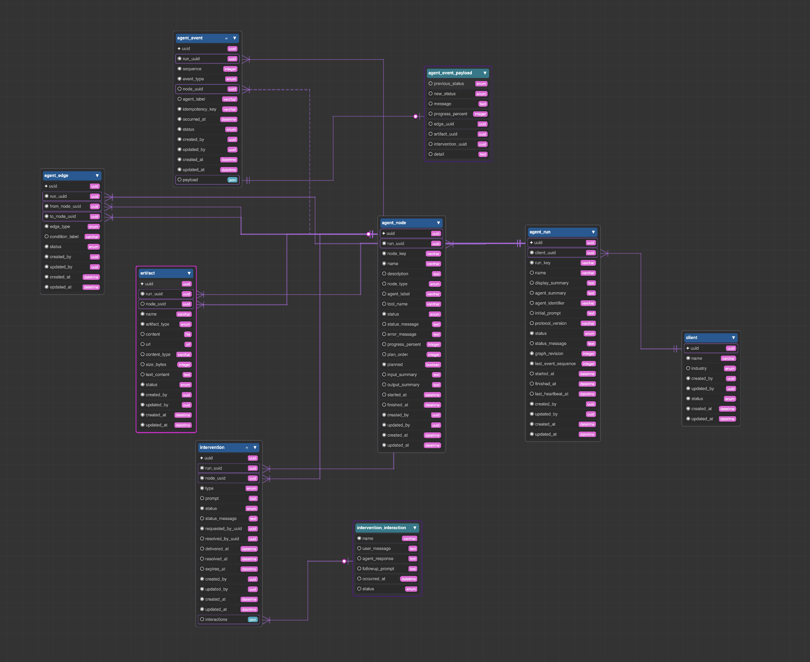

# Donald

**A supervision surface for agents that act.**

NextWave Hackathon 2026 · CDMX · Challenge 3 — *The Interface That Builds Itself*

---

## See it live

Three runs, three different shapes, same protocol:

- **Missing invoice** — https://usedonald.com/runs/missing-invoice
- **Replan under new evidence** — https://usedonald.com/runs/replan
- **Land pickup conflict** — https://usedonald.com/runs/land-pickup

Connect your own agent to Donald over MCP (no authentication in the demo):

```json
{ "mcpServers": { "donald": { "type": "http", "url": "https://mcp.usedonald.com/v1/mcp" } } }
```

---

## The problem

Companies like **Nauta** sell AI agents that do more than alert: **they execute**. They send
emails, book trucks and dispute invoices, 24/7. Their own website says it plainly:

> *“Agents that do not send an alert and wait. **They act.**”*

That leaves a gap:

| | |
|---|---|
| An agent that only **alerts** | The person reads, decides and acts. The person remains in control. |
| An agent that **acts** | Things happen without them. *How do I trust something that has already acted?* |

> **An agent that only alerts can be audited by reading the alert.
> An agent that acts needs a window — and a brake.**

Donald is that window and that brake. The operator watches the agent's reasoning **build itself
on screen as it happens**, and can **stop** or **redirect** it.

**We change nothing about the provider.** Its stages, logic and actions stay intact. We only ask
the agent to expose its intent and report when that intent changes.

---

## How it works — the five-verb protocol

Any agent that speaks these five verbs becomes supervisable:

| Verb | The agent says | Donald draws |
|---|---|---|
| **DECLARE** | *“I propose these N steps”* | staggered gray nodes |
| **ADVANCE** | *“I am on step 3; this is what I found”* | the node pulses and the edge draws itself |
| **REPLAN** | *“The plan changed: remove this, add that”* | **the graph rewires itself** |
| **ASK** | *“I need you to decide”* | the node expands into a decision panel |
| **FINISH** | *“I am done; this is what happened”* | the run collapses into a summary |

What we ask for is a **proposal, not a commitment**:

> *“We know you have a lot to do. Just propose your plan — even if it changes.”*

**A changing plan is not failure; it means the agent learned something.** If the plan never
changed, the interface would never rebuild itself and there would be nothing to demonstrate.
That is why every replan carries its cause (`reason`, `triggered_by`, `evidence`) — without it,
the change looks like a mistake; with it, the system looks like it learned.

---

## The pieces

```
  ANY REAL AGENT             skill/              ← teaches the agent the domain and reporting loop
  (any MCP client)              │
                               │  MCP · 5 verbs · https://mcp.usedonald.com/v1/mcp
                               ▼
  backend/donald/             ← Go generated by nuzur + MCP server
            │                    entities: agent_run · agent_node · agent_edge
            │                    agent_event · intervention · artifact
            ▼
  https://api.usedonald.com/    ← REST + live event stream
            │
            ▼
  frontend/                   ← Next + React Flow. Snapshot + SSE deltas; the graph
                                 shape is computed from the edges, never hand-authored.
```

| Folder | What it is |
|---|---|
| [`backend/donald/`](backend/) | Go backend generated by nuzur from the `v2-run-graph-events` model, plus the MCP server in `app/mcp/`. **Generated files are not edited** — see `backend/donald/AI.md`. Custom work belongs in `app/`. |
| [`frontend/`](frontend/) | Next 16 + React Flow. Graph positions are calculated from data, never hand-authored. |
| [`skill/`](skill/) | `donald-flow` teaches any agent to report through MCP; `nauta-operations` gives the demo agent a coherent importer data landscape. |
| [`deploy/`](deploy/) | Helm charts for the deployed API, MCP endpoint and web surface. |

### Deployment and data flow

One Linode host running microk8s. The **same container image** runs twice — `DONALD_ROLE=mcp` serves
agents, `DONALD_ROLE=api` serves browsers — so a slow agent cannot degrade the graph someone is
watching. Green is the agent writing, blue is reading and serving, red is the operator pushing back.



The red path is the whole product: an operator's stop or steer is written as an event, picked up by the
agent on its next `check_instructions`, and honoured by **changing the plan**. It is advisory — these
agents are not ours to kill — and the interface says so rather than pretending otherwise.

### The domain model

Nine entities. **`agent_event` is the source of truth** — append-only, with a per-run monotonic
`sequence` and a unique `idempotency_key`. Everything else is a materialised snapshot of it:
`agent_node` and `agent_edge` exist so a client can start without replaying the whole log, and can be
rebuilt from it at any time. `agent_event_payload` and `intervention_interaction` are dependent
entities — typed JSON, not bare columns.



---

## See it in five minutes

**Start the frontend:**

```bash
cd frontend
npx pnpm@10 install
npx pnpm@10 dev          # http://localhost:3000
```

**Connect a real agent** — see [`skill/README.md`](skill/README.md). Add Donald as a
streamable-HTTP MCP server; there is no authentication in the demo:

```json
{ "mcpServers": { "donald": { "type": "http", "url": "https://mcp.usedonald.com/v1/mcp" } } }
```

Give the MCP client both [`donald-flow`](skill/donald-flow/) and
[`nauta-operations`](skill/nauta-operations/). Then type any operational request, for example:

> *“L'Oréal's invoice does not match our PO. Find out what happened and draft the right email.”*

The provider in this demo is a **real agent reading those skill files**. There is no scenario
selector: the input is whatever the operator types, the agent chooses its own plan, and the graph
is non-deterministic because it is built from the steps the agent actually takes.

---

## The requests that demonstrate the product

Each produces a **different shape on screen**. That is the proof that the interface comes from
the work, not from a script. These are examples, not presets.

| Case | Example request | Shape |
|---|---|---|
| **It stays quiet** | *“What is the status of OP-4471?”* | Routine checks collapse into a line. No needless interruption. A system that always shouts is as useless as one that is blind. |
| **It replans and asks** | *“Handle the transshipment on OP-4471.”* | Unplanned transshipment · $3,780 demurrage exposure · invalidated BL. **The graph rewires itself** and a decision panel appears. |
| **It crosses domains** | *“Why does L'Oréal's invoice disagree with our PO?”* | Supplier invoice · missing amendment · exact $840 gap · our error. Different evidence and steps, **zero new frontend code.** |

The third case proves the system is open-ended: it was added by expanding the agent's knowledge,
without writing a new flow or changing the frontend.

---

## Why time matters

The steps unfold while a real agent reads, reconciles, calculates and decides what comes next.
That is not decorative delay:

> **Duration is the intervention window.** You can only stop something that is still happening.
> If every step completes instantly, the stop button is decoration.

The graph stays current as the agent works: progress appears when something takes time, a block
is visible when the agent needs missing data, and a replan appears the moment new evidence changes
the work. The timing belongs to the task, not to a prerecorded sequence.

---

## Documents

| | |
|---|---|
| [`docs/donald-architecture.png`](docs/donald-architecture.png) | Deployment and data flow — pods, database, ingress, and the intervention path |
| [`docs/donald-domain-model.png`](docs/donald-domain-model.png) | The nine entities and their relationships, as modelled in nuzur |
| [`PROBLEM.md`](PROBLEM.md) | The operator (Jorge, 52), the thesis, the metric and the anti-scope |
| [`DECISIONS.md`](DECISIONS.md) | The engineering decisions, the alternatives we rejected, and why |
| [`PITCH.md`](PITCH.md) | The pitch script, minute by minute, with the hard Q&A |
| [`CONTEXT.md`](CONTEXT.md) | The boundary with Nauta, agent skills and the `ui_spec` vocabulary |
| [`skill/README.md`](skill/README.md) | How to connect an agent to Donald over MCP |
| [`skill/nauta-operations/SKILL.md`](skill/nauta-operations/SKILL.md) | The importer world the demo agent can investigate |
| [`backend/donald/AI.md`](backend/donald/AI.md) | Which generated backend files are editable and which are not |

---

## Status

**End to end, redeployed on the team's own domain.** The Go + MySQL backend and the MCP server
run at `usedonald.com` / `api.usedonald.com` / `mcp.usedonald.com`; an agent reports through MCP,
the events land in MySQL, and the frontend draws the graph from them as they arrive. OpenAI is
enabled for suggestions.

The three demo runs — `missing-invoice`, `replan`, `land-pickup` — are served as **replayable
recordings** through the exact same reducer and components as the live path. That is by design:
the pitch does not depend on the network. **Any other run key streams live from the API** — an
agent working right now, a run a judge just asked for — and accepts interventions.

```
✅  backend + REST API + MCP server deployed on the team's own infrastructure
✅  donald-flow + nauta-operations skills
✅  Next.js + React Flow frontend deployed; OpenAI-backed suggestions enabled
✅  the three demo runs replay from recordings; every other run key streams live (SSE)
✅  every run has its own shareable URL, handed to the agent at start_run
⚠️  no authentication: anyone who can reach the MCP endpoint can write runs
⚠️  artifact byte uploads need R2 credentials; links and inline text work today
⚠️  single box, single MySQL pod on a hostPath volume, no backups
```

### Live surfaces

| | |
|---|---|
| `https://usedonald.com/runs/<run_key>` | one run, watched live |
| `https://api.usedonald.com/v1/runs` | run list, newest first |
| `https://api.usedonald.com/v1/runs/<run_key>` | snapshot + `last_sequence` |
| `https://api.usedonald.com/v1/runs/<run_key>/stream?after=N` | SSE deltas after a cursor |
| `https://mcp.usedonald.com/v1/mcp` | the agent-facing MCP server |

### Share the link before the work starts

`start_run` returns a **`watch_url`**, and the skill tells the agent to show it immediately:

> Follow along: `https://usedonald.com/runs/sess_8f21`

The URL is built from the agent's own `run_key`, so it is known before a single step has run.
A link produced at the end is a link nobody opened.

### Known limits worth stating plainly

- **Runs recorded before a fix keep the gaps that fix closed.** Graph structure is reconstructed
  from the event log, so a run whose events predate an improvement renders the way it was
  recorded. Re-run it rather than expecting a repair.
- **Interventions are advisory.** The agents are not ours to control, so a stop reaches the agent
  on its next `check_instructions` and it complies if it can. That is honest supervision, not a
  kill switch.
- **Demo pacing is on** (`DONALD_DEMO_PACING`), which exposes a `wait` tool so runs unfold at a
  readable speed. It must be turned off before production — an agent should never be able to park
  a request on the server.
